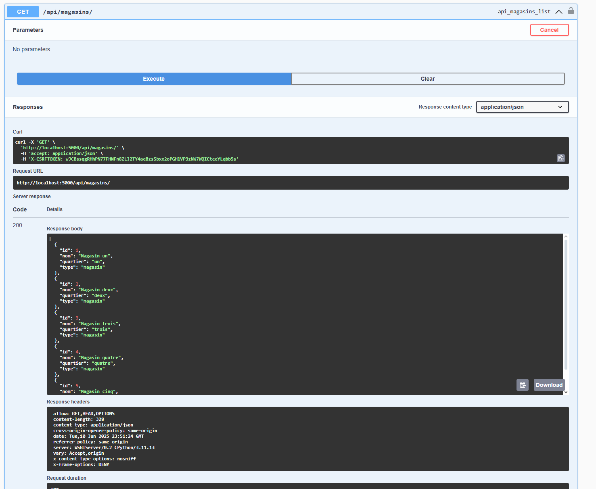

# Application de magasin

## Description
NOTE : Du aux changements d'architecture enc ours, à pars la page d'acceuil principale les autres pages ne sont pas disponibles.
Il s'agit d'une application **web** de caisse enregistreuse développée avec **Django** et une base de données **MySQL**.  
L'application supporte plusieurs magasins (multi-sites) ainsi que des entités administratives comme la maison mère et le centre logistique.  
Plusieurs caisses peuvent être utilisées simultanément avec une gestion cohérente des stocks et des ventes.  

L’application permet :
- La consultation et la recherche de produits par magasin
- La gestion d’un panier (ajout, retrait, affichage)
- La finalisation des ventes à partir du panier
- La gestion administrative (maison mère, centre logistique, rapports, approvisionnement)
- Le réapprovisionnement entre entités via le centre logistique (présentement HS)

L'interface est construite en Django avec des vues modulaires, et la logique métier est bien séparée dans des services Python.
Une API as été ajoutée et est exposée.

## Installation des dépendances (À la racine du projet) 

Sur un système Linux, installer Docker et Docker Compose si ce n’est pas déjà fait :  
sudo apt install docker docker-compose

## Instructions de lancement de l'application :
1. Pour utiliser l'application et avoir accès au site web, soit : http://localhost:5000/
2. docker compose down (pour fermer un conteneur déjà existant au cas où)
3. docker compose build --no-cache
4. docker compose up

## Instructions de lancement des tests :
NOTE : lLes tests ne sont présentement pas fonctionnels.
1. docker compose build --no-cache
2. docker compose up -d 
3. docker compose exec app python manage.py init_test_db
4. docker compose exec app pytest 

## Utilisation de l'application
La page d'accueil propose le choix entre ouvrir une caisse (choisir un magasin) ou accéder à l'administration.
Dans la caisse, il est possible de rechercher des produits, ajouter ou retirer des articles dans un panier, puis finaliser une vente.
Le panier est géré en session utilisateur, et la finalisation met à jour les stocks de façon atomique.
L’administration permet la gestion des entités (maison mère, centres logistiques), la modification des produits, le suivi des ventes et la gestion des approvisionnements entre magasins.

##  Collection de requêtes de l'API
NOTE : Cette partie est aussi potentiellement non disponible à cause des changements en cours. Merci de votre compréhension.
une fois le service lancé, voir les deux liens suivants :
http://localhost:5000/swagger/
http://localhost:5000/redoc/

Ils contiennent la documentation des endpoints de l'API.
Tu peut même tester les endpoints sur le liens /swagger avec l'option try it out.
Pour t'authentifier, utilise les credentials suivantes :
-username : super_caisse_user
-password : supersecret

Il s'agit d'un des seuls user utiliseables, d'autres seront créer plus târd.
Par manque de temps certaines parties de l'API nécéssitent plus d'attention et des changements mais au moins elle est fonctionelle de manière générale.

De plus, en ce moment le cors est set pour accepter des requêtes de n'importe où, mais ce sera changer dans une future mise à jour.

Enfin voici un example de test à partir de l'interface swagger :
