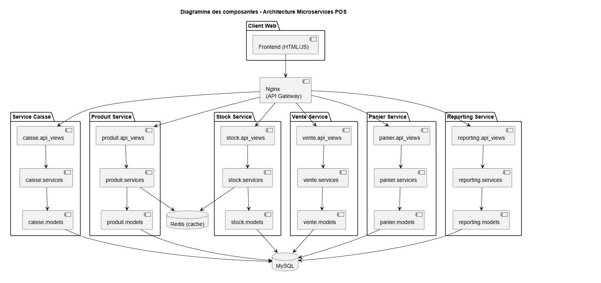
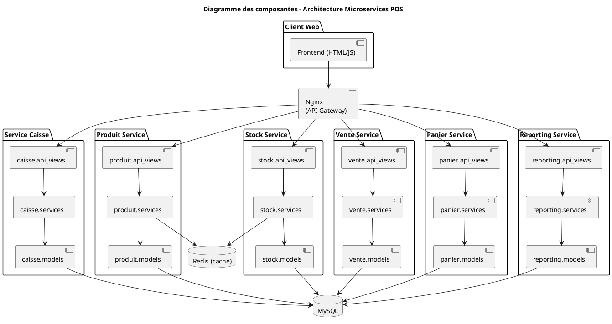
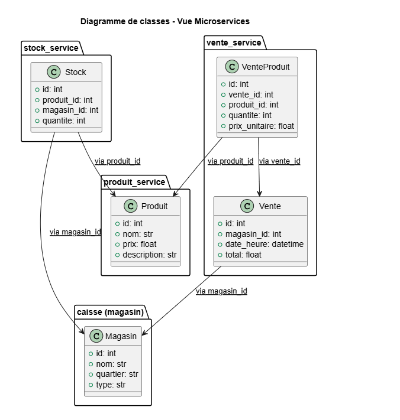
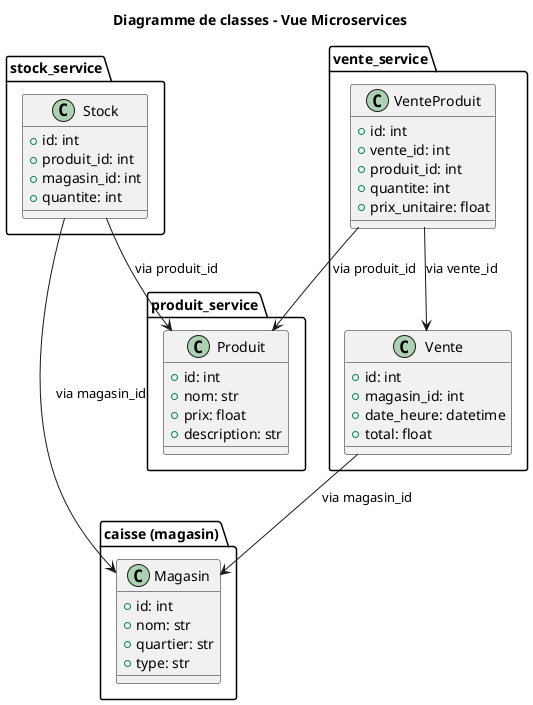
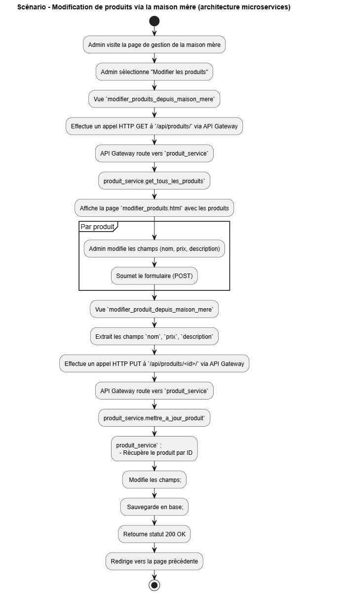
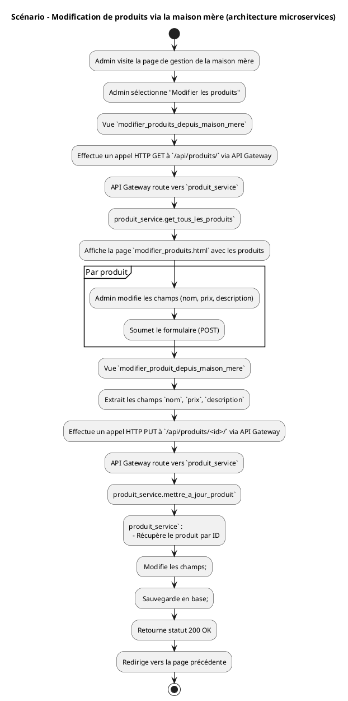
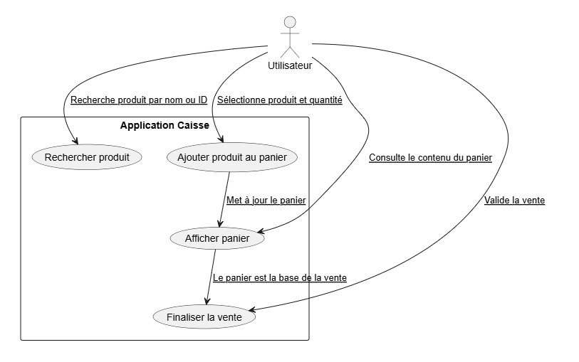
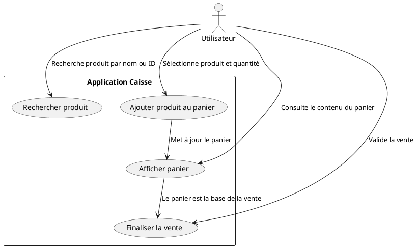
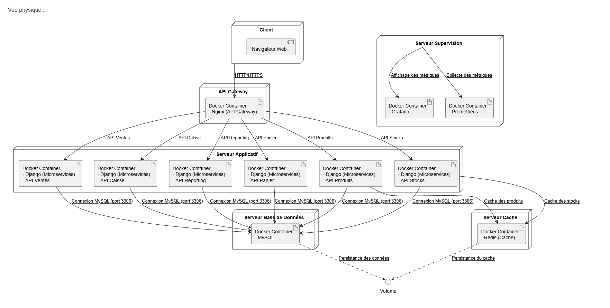
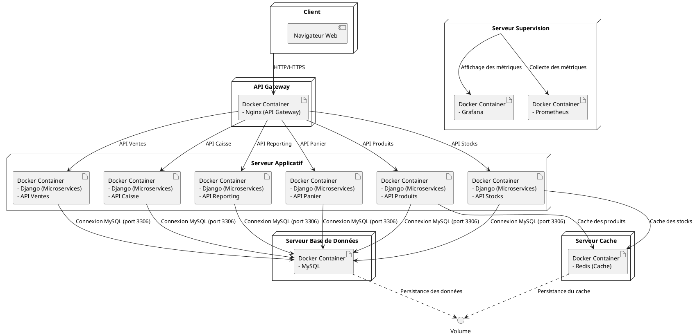

# Rapport Cédric Bossé - Application Caisse Multi-utilisateurs

---
Répositoire github : https://github.com/CedricBosseETS/Lab0_CedricBosse/releases/tag/Lab5_remise
---

## 1. Introduction et objectifs

Dans le cadre de l’évolution de l’application de caisse, une refonte de l’architecture a été amorcée afin de migrer vers une approche orientée microservices. Chaque domaine fonctionnel (produits, stocks, ventes, etc.) a été isolé dans un conteneur dédié, avec ses propres endpoints API et logique métier. Pour renforcer la performance et la résilience, un système de cache Redis a été ajouté, ainsi qu’un observateur de métriques via Grafana et Prometheus. Un API Gateway a été mis en place pour centraliser les accès, accompagné d’un load balancer pour répartir la charge. Ces changements visent à améliorer la scalabilité, la maintenabilité et la supervision du système.
Il est important que je mentione une chose par contre. Du aux contraintes de temps. Le code n'est pas totalement représentatif de ce qui est écrit dans ce rapport. C'est à dire qu'il constitue mon plan actuel et que c'est majoritairement en cours. En l'état actuel, j'ai mis l'API Gateway et j'ai séparer en microservices mais l'application n'est pas fonctionnelle car je n'ai pas finis d'ajuster les API et de défaire le fort couplage qui était encré dans mon code.

---

## 2. Contraintes

- Chaque service doit être autonome, avec une dépendance minimale vis-à-vis des autres. Cela implique de ne plus accéder directement aux modèles ou fonctions internes d’un autre service, et d’utiliser des appels API pour toute interaction.
- Les données mises en cache doivent rester synchronisées avec la base de données. Il faut donc définir des règles d’invalidation précises.
- Tous les services doivent exposer des métriques au format Prometheus, ce qui nécessite un middleware ou une configuration spécifique dans chaque conteneur.
- L’ensemble des routes doit être connu et bien définies dans la configuration du proxy inverse. Cela limite la flexibilité en cas de routes dynamiques.  Il faut aussi gérer les en-têtes (authentification, CORS, etc.) de manière centralisée.

---

## 3. Contexte

L’application initiale était monolithique, ce qui limitait sa maintenabilité, sa scalabilité et sa résilience. Toute la logique métier (ventes, stocks, produits, etc.) était centralisée dans un seul service Django avec une base de données unique. Cela compliquait la collaboration, augmentait le couplage entre modules et rendait difficile la montée en charge.
- Découper l’application en microservices
- Ajouter un cache Redis
- Mettre en place une observabilité avec Grafana et Prometheus
- Intégrer un Load Balancer (via Nginx)
- Utiliser une API Gateway (Nginx aussi)

---

## 4. Stratégie de solution

Pour atteindre les objectifs visés, la première stratégie adoptée a été de refactorer l’architecture en services indépendants. Chaque domaine fonctionnel (produits, stocks, ventes, etc.) a été isolé dans un microservice distinct, chacun géré par son propre conteneur Docker. Ce découpage a permis de réduire le couplage entre les modules et d’implémenter plus facilement des règles métier spécifiques à chaque domaine.

Ensuite, une API Gateway basée sur Nginx a été configurée pour centraliser les accès aux différents services. Elle joue le rôle d’un point d’entrée unique, simplifiant la gestion des routes internes, la configuration des CORS, ainsi que l’ajout de futures règles d’authentification et de journalisation. Grâce à cette couche, tous les appels inter-services passent désormais par des APIs REST exposées de manière uniforme.

Parallèlement, un mécanisme de cache Redis a été introduit pour optimiser l’accès aux données fréquemment consultées, notamment les stocks. Ce cache permet de diminuer la latence perçue par les utilisateurs et d’alléger la pression sur la base de données. Des règles simples de mise en cache et d’invalidation ont été mises en place pour conserver la cohérence des données.

Enfin, un système d’observabilité avec Grafana et Prometheus a été déployé pour suivre les métriques essentielles (Golden Signals), comme les taux d’erreur, la latence des endpoints et le débit de requêtes. En parallèle, un load balancer a été intégré via la configuration de Nginx, permettant de tester la répartition de charge entre plusieurs réplicas d’un même service. Des scénarios de montée en charge et de panne ont été simulés pour valider la résilience globale de l’architecture.

---

## 5. Vue des blocs de construction

L’application a été structurée selon une architecture modulaire orientée services. Le système principal est divisé en plusieurs blocs fonctionnels déployés sous forme de microservices : un service de gestion des produits, un service de gestion des stocks, un service de ventes, un service de reporting, un service de panier et un service de caisse/magasin. 
Ces blocs sont exposés via des APIs REST et communiquent exclusivement entre eux à travers une API Gateway. Le frontend (HTML + JS) est relié au backend via cette passerelle, garantissant une séparation claire entre l’interface utilisateur et les services métier. Un cache Redis complète l’architecture pour améliorer la performance, tandis que Grafana et Prometheus forment le bloc d’observabilité. Chaque bloc est encapsulé dans un conteneur Docker et déployé indépendamment via Docker Compose.

Vue de développement, diagramme des composantes :

---

Vue logique et diagramme de classe : 

---

## 6. Vue d’exécution (runtime)

Scénarios clés :
- Ouverture d’une caisse : déclenchée par la sélection d’un magasin via l’interface, les données du magasin sont récupérées dynamiquement via l’API Gateway.
- Ajout et retrait d’articles au panier : gérés par le service panier_service, avec un panier propre à chaque session utilisateur, stocké via request.session dans Django.
- Validation d’une vente : déléguée au vente_service via un appel API. Ce service vérifie les stocks (en appelant stock_service), enregistre la vente, puis déclenche la mise à jour des quantités disponibles.
- Gestion des sessions utilisateur : Django conserve l’état du panier via le middleware de sessions HTTP. Cela permet de garantir un panier isolé par utilisateur, même à travers plusieurs appels API.

Vue des processus : le diagramme suivant illustre un scénario d’exécution typique côté administrateur pour la modification de produits via l’interface de la maison mère.

Vue des scénarios : les cas d’utilisation suivants décrivent les interactions principales d’un utilisateur avec l’interface de la caisse.

---

## 7. Vue de déploiement

Le déploiement de l’application repose sur Docker Compose, dans le cadre d'une refonte progressive du projet initialement monolithique. Chaque service métier (produits, stocks, ventes, etc.) est encapsulé dans un conteneur Docker distinct, reflétant l’architecture microservices en construction.
Actuellement, la stack comprend :

- Plusieurs conteneurs Python (Django REST) pour les services métier
- Un conteneur MySQL partagé temporairement entre les services (étape transitoire avant une éventuelle séparation par base) ;
- Un conteneur Redis pour la mise en cache ;
- Un conteneur Nginx jouant le rôle à la fois d’API Gateway et de reverse proxy ;
- Un conteneur Prometheus et un conteneur Grafana pour la supervision.
- 
Le déploiement est centralisé dans un fichier docker-compose.yml qui décrit la configuration réseau, les dépendances inter-services, les volumes de persistance (notamment pour MySQL et Grafana), ainsi que les points d’entrée des services. Le cache Redis et la base MySQL utilisent des volumes Docker pour garantir la persistance des données.

Vue physique : 

---

## 8. Concepts transversaux

Dans cette refonte vers une architecture microservices, plusieurs concepts transversaux ont été intégrés pour améliorer la scalabilité, la résilience et la surveillance du système.
- Chaque domaine fonctionnel (produits, stocks, ventes, etc.) est isolé dans un microservice indépendant, permettant une meilleure gestion des dépendances et une évolution autonome des services.
- L’API Gateway (Nginx) centralise les accès aux microservices, simplifiant le routage, la gestion des CORS et l’authentification.
- Un cache Redis est utilisé pour réduire la latence et alléger la charge sur la base de données, avec des règles d’invalidation pour garantir la cohérence des données.
- Grafana et Prometheus assurent l’observabilité en temps réel du système, en collectant et affichant des métriques critiques telles que la latence et le taux d’erreur.
- La scalabilité horizontale est facilitée par Docker et un load balancer, permettant une gestion dynamique de la charge et une haute disponibilité des services.
- L'API Gateway gère de manière centralisée l’authentification et la sécurité des communications entre les services.

---

## 9. Décisions

Extraits des décisions architecturales :
- Adoption d’une architecture microservices avec isolation des domaines fonctionnels
- Mise en place de Docker et Docker Compose pour la conteneurisation des services
- Utilisation de Nginx comme API Gateway pour centraliser les accès aux services
- Intégration de Redis pour la gestion du cache et optimisation des performances
- Surveillance via Prometheus et Grafana pour la collecte et la visualisation des métriques
- Scalabilité assurée par un load balancer Nginx

Ces décisions ont été prises pour garantir la scalabilité, la performance, et la résilience de l'application tout en facilitant sa gestion et son déploiement.
Cependant, l’application ne dispose pas encore d’un mécanisme de journalisation centralisé. Cela limite la capacité à diagnostiquer les erreurs et à suivre les transactions critiques. Cette fonctionnalité sera intégrée dans les futures étapes du projet pour améliorer la traçabilité et la maintenabilité. De plus, la abse de donnée est encore partagée et pour bien atteindre l'état de microservice ils era essentiel de changer cela.

---

## 10. Scénarios de qualité

L’application a été conçue pour répondre à plusieurs exigences de qualité essentielles :

Testabilité : Les principales fonctionnalités, telles que la gestion des stocks, l'ajout au panier et la validation des ventes, sont couvertes par des tests unitaires et d'intégration. Ces tests sont exécutés automatiquement à chaque commit via GitHub Actions.

Maintenabilité : L'architecture modulaire, avec une séparation claire des services (produit, stock, panier, vente), facilite l'évolution de l'application. L'ajout de nouvelles fonctionnalités ou la modification de comportements est simplifié.

Qualité du code : Chaque commit subit une analyse statique via Pylint dans le pipeline CI/CD. Si les critères minimaux de qualité ne sont pas respectés, le pipeline échoue, garantissant ainsi un code cohérent et propre.

Performance : L'application assure une performance optimale même avec une charge utilisateur importante, grâce à l'utilisation de Redis pour le cache, et à une gestion efficace des accès concurrents via des mécanismes transactionnels.

Déployabilité et portabilité : Grâce à la conteneurisation via Docker et Docker Compose, le déploiement reste uniforme et rapide, que ce soit en environnement local ou en production, tout en garantissant la portabilité de l'application.

---

## 11. Risques et dette technique

### Risques liés à la gestion des microservices

Le découpage en microservices présente des avantages indéniables en termes de scalabilité et d’autonomie des composants, mais il introduit également des risques :
Complexité de l'intégration : La communication entre services via des APIs expose le système à des problèmes d'intégration, notamment en cas de modifications non synchronisées des interfaces.

Gestion des transactions distribuées : La gestion des transactions globales entre services reste complexe, surtout en cas d’erreur ou de panne, ce qui pourrait entraîner des incohérences dans les données.

### Dette technique sur le découplage des API

Bien que les services soient bien séparés, une partie du code reste encore fortement couplée. Le découplage complet des API et la refonte des endpoints sont en cours, mais cela crée une dette technique :

Couplage résiduel : Certaines logiques métier partagées entre les services n'ont pas encore été totalement séparées, ce qui nuit à la flexibilité à long terme.

Documentation et gestion des API : Les API ne sont pas encore pleinement documentées et standardisées, ce qui complique leur gestion, surtout lorsqu’il s'agit de faire évoluer le système.

### Manque de mécanismes de journalisation

L’absence de journalisation centralisée reste un risque majeur. Elle limite la capacité à diagnostiquer des erreurs en production et à assurer une traçabilité fiable des actions utilisateurs et des modifications des stocks.

### Difficulté de montée en charge

Malgré la mise en place de Redis et de mécanismes de mise à l’échelle via Docker et Nginx, il reste des incertitudes concernant la gestion des pics de charge en cas de forte utilisation des services, notamment pendant les périodes de forte activité.

---

## 12. Glossaire

- **Caisse** : point de vente utilisant l’application  
- **Panier** : sélection temporaire de produits avant validation de la vente  
- **Vente** : transaction enregistrée dans la base de données  
- **Produit** : article vendable avec stock associé  
- **Magasin** : lieu de vente physique ou virtuel  
- **Transaction** : ensemble des opérations atomiques pour garantir la cohérence des données  
- **Session** : instance utilisateur durant l’utilisation de la caisse
