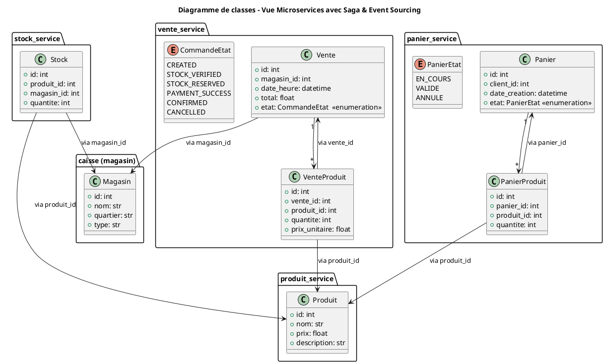
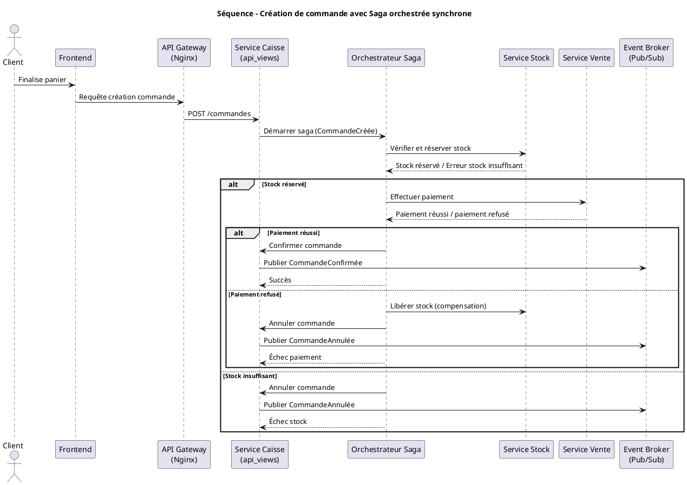
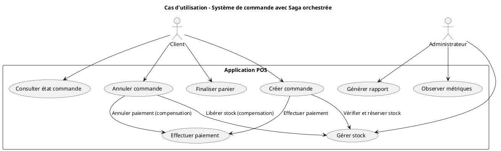
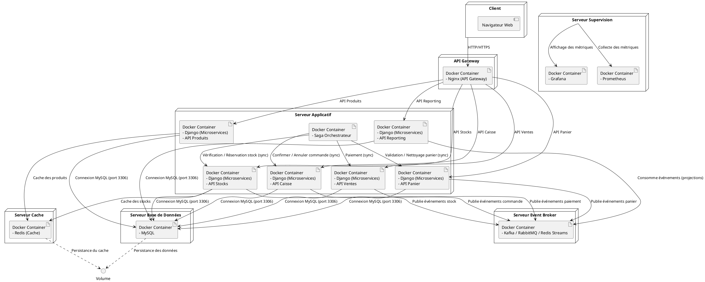

# Rapport Cédric Bossé - Application Caisse Multi-utilisateurs

---
Répositoire github : https://github.com/CedricBosseETS/Lab0_CedricBosse/tree/ajout-microservices
---

## 1. Introduction et objectifs

Durant la dernière remise de ce projet, j’ai mentionné ne pas avoir terminé la mise en place prévue, notamment à cause d’un fort couplage du code initial, de problèmes de communication interne entre microservices (erreurs 401 Unauthorized) et d’un manque de temps global. Ultimement, on pourrait aussi dire qu'un mauvais respect et découpage de responsabilités selon DDD as été effectué dans les premières étapes de ce projet et ça ma finalement rattrapé. Je n’ai donc pas pu entreprendre la prochaine étape d’évolution, qui consistait à intégrer une Saga orchestrée synchrone pour coordonner des transactions distribuées, suivie de l’implémentation d’une architecture événementielle basée sur Pub/Sub, Event Sourcing, CQRS et une Saga chorégraphiée. Ces améliorations visent à renforcer le découplage, la résilience, l’historisation des événements métiers et l’observabilité du système.
Pour le biens de la lisisbilité de ce rapport, même si ce qui est écrit n'est pas réalisé, il sera mentionné comme si ce l'était. Par example "les services exposent une api documentées". Ça représente ce qu'ultimement j'aurais aimer réaliser.

---

## 2. Contraintes

- Les mécanismes de rollback partiel doivent être intégrés pour gérer les échecs à une étape de la transaction distribuée.
- La machine d’état de la commande doit refléter en temps réel la progression du processus et être persistée pour reprise après incident.
- Les APIs des différents services doivent être adaptées pour supporter les échanges synchrones de l’orchestrateur tout en restant compatibles avec les clients existants.
- Mettre en place un service orchestrateur.

---

## 3. Contexte

Dans son état actuel, l'application utilise des appels à travers les API respectives de chaque service pour communiquer entre eux. Il s'agit d'une mauvaise pratique et doit être remplacé par l'utilisation de Sagas, our plusieurs raisons. Ça va permettre de garantir la cohérence transactionnelle entre microservices, réduire les risques d’incohérences de données, améliorer la résilience face aux échecs partiels et offrir une meilleure traçabilité des étapes métier.

---

## 4. Stratégie de solution

Pour atteindre les objectifs visés, la première étape consistera à mettre en place un service orchestrateur centralisé, chargé de coordonner les transactions distribuées entre les différents microservices. Chaque étape du processus métier (vérification de stock, réservation, paiement, confirmation) sera exécutée via des appels synchrones, tout en assurant une gestion stricte des statuts de commande et des transitions d’état persistées. Ce service intégrera également des mécanismes de rollback partiel pour compenser les opérations en cas d’échec.

Ensuite, les APIs des services impliqués seront adaptées pour supporter la communication orchestrée. Les endpoints existants seront enrichis ou complétés afin de fournir les données nécessaires à l’orchestrateur, tout en restant compatibles avec les intégrations déjà en place. Un schéma clair des flux de données sera établi pour éviter toute ambiguïté dans les échanges inter-services.

En parallèle, une couche de traçabilité et d’observabilité sera mise en place afin de suivre l’exécution des transactions en temps réel. Les événements métier et les transitions d’état seront journalisés de manière centralisée, permettant d’identifier rapidement les points de défaillance et de faciliter le débogage. Cette instrumentation viendra compléter les métriques déjà collectées par Prometheus et Grafana pour offrir une vue complète de la santé du système.

---

## 5. Vue des blocs de construction

L’architecture cible repose sur un ensemble de microservices spécialisés, chacun encapsulant un domaine fonctionnel précis :
- Service Produits : gestion des informations produit (catalogue, prix, attributs).
- Service Stocks : suivi des quantités disponibles et opérations de réservation.
- Service Ventes : enregistrement et suivi des transactions de vente.
- Service Panier : gestion temporaire des articles sélectionnés par les clients avant validation.
- Service Reporting : génération de rapports et indicateurs métiers.
- Service Orchestrateur Synchrone : coordination des étapes critiques des processus métiers distribués (ex. : création de commande), gestion des transitions d’état et exécution de compensations en cas d’échec.

Chaque service est déployé dans son propre conteneur Docker et expose une API REST documentée (Swagger/OpenAPI). Les communications inter-services passent par une API Gateway basée sur Nginx, assurant un point d’entrée unique, la gestion des CORS, la journalisation et le routage interne.

Un cache Redis est utilisé pour accélérer les requêtes fréquentes (notamment sur les stocks) et réduire la charge sur les bases de données relationnelles. L’observabilité serait assurée via Prometheus et Grafana, offrant un suivi des métriques essentielles et un diagnostic rapide des incidents. Enfin, un load balancer intégré à la configuration Nginx permet de répartir le trafic entre plusieurs instances d’un même service afin d’augmenter la résilience et la capacité de montée en charge.

Vue de développement, diagramme des composantes :
Comme le diagramme est trop gros, une image sera inclus lors de la remise.

```plantuml
@startuml
!define RECTANGLE class

title Diagramme des composantes – Architecture Microservices POS + Saga & Événementielle

package "Client Web" {
  [Frontend (HTML/JS)]
}

component "Nginx\n(API Gateway)" as NGINX

database "MySQL" as DB
database "Redis (cache)" as REDIS

package "Event Infrastructure" {
  component "Event Broker\n(Kafka / RabbitMQ / Redis Streams)" as EVENT_BROKER
  database "Event Store\n(persistant)" as EVENT_STORE
  component "Prometheus\n+ Grafana" as OBSERVABILITY
}

package "Saga Orchestrateur" {
  [Saga Orchestrateur\n(Labo 6)]
}

package "Service Caisse" {
  [caisse.api_views]
  [caisse.services]
  [caisse.models]
}

package "Produit Service" {
  [produit.api_views]
  [produit.services]
  [produit.models]
}

package "Stock Service" {
  [stock.api_views]
  [stock.services]
  [stock.models]
}

package "Vente Service" {
  [vente.api_views]
  [vente.services]
  [vente.models]
}

package "Panier Service" {
  [panier.api_views]
  [panier.services]
  [panier.models]
}

package "Reporting Service (CQRS)" {
  [reporting.api_views]
  [reporting.services (Query Model)]
  [reporting.models]
}

' Relations frontales
[Frontend (HTML/JS)] --> NGINX

' Gateway redirige vers APIs
NGINX --> [caisse.api_views]
NGINX --> [produit.api_views]
NGINX --> [stock.api_views]
NGINX --> [vente.api_views]
NGINX --> [panier.api_views]
NGINX --> [reporting.api_views]

' Couches internes par service
[caisse.api_views] --> [caisse.services]
[caisse.services] --> [caisse.models]
[produit.api_views] --> [produit.services]
[produit.services] --> [produit.models]
[stock.api_views] --> [stock.services]
[stock.services] --> [stock.models]
[vente.api_views] --> [vente.services]
[vente.services] --> [vente.models]
[panier.api_views] --> [panier.services]
[panier.services] --> [panier.models]
[reporting.api_views] --> [reporting.services (Query Model)]
[reporting.services (Query Model)] --> [reporting.models]

' Accès à la DB partagée
[caisse.models] --> DB
[produit.models] --> DB
[stock.models] --> DB
[vente.models] --> DB
[panier.models] --> DB
[reporting.models] --> DB

' Cache Redis
[stock.services] --> REDIS
[produit.services] --> REDIS

' Saga Orchestrateur interactions (Labo 6)
[Saga Orchestrateur\n(Labo 6)] --> [stock.api_views] : Appels synchrones (verif & reservation)
[Saga Orchestrateur\n(Labo 6)] --> [vente.api_views] : Appels synchrones (paiement)
[Saga Orchestrateur\n(Labo 6)] --> [caisse.api_views] : Mise à jour état commande

' Événements Pub/Sub (Labo 7)
[stock.services] --> EVENT_BROKER : Événements métier (StockRéservé, StockLibéré)
[vente.services] --> EVENT_BROKER : Événements métier (PaiementRéussi, PaiementEchoué)
[caisse.services] --> EVENT_BROKER : CommandeCréée, CommandeConfirmée
[panier.services] --> EVENT_BROKER : AjoutArticle, SuppressionArticle

EVENT_BROKER --> [reporting.services (Query Model)] : Consommation événements (projection CQRS)
EVENT_BROKER --> [caisse.services] : Consommation événements (ex: Notification)
EVENT_BROKER --> [vente.services] : Consommation événements (ex: Audit)

' Event Store persistant
EVENT_BROKER --> EVENT_STORE : Stockage événements
[reporting.services (Query Model)] --> EVENT_STORE : Relecture / projection

' Observabilité
[caisse.services] --> OBSERVABILITY
[stock.services] --> OBSERVABILITY
[vente.services] --> OBSERVABILITY
[panier.services] --> OBSERVABILITY
[reporting.services (Query Model)] --> OBSERVABILITY
EVENT_BROKER --> OBSERVABILITY

@enduml

```

---

Vue logique et diagramme de classe : 

---

## 6. Vue d’exécution (runtime)

Scénario : Création d’une commande client avec Saga orchestrée synchrone
- Le client finalise son panier dans le service Panier.
- Le service Caisse reçoit la demande de création de commande.
- Le service Orchestrateur Saga démarre la saga à l’événement CommandeCréée.
- L’orchestrateur appelle synchronement le service Stock pour vérifier et réserver les articles.
- Si le stock est disponible, l’orchestrateur appelle le service Vente pour effectuer le paiement.
- Si le paiement est accepté, l’orchestrateur confirme la commande (CommandeConfirmée).
- En cas d’échec (stock insuffisant ou paiement refusé), l’orchestrateur lance les actions de compensation (ex : libération du stock) et annule la commande.
- Chaque service publie ses événements métier vers le bus d’événements pour assurer la traçabilité, la mise à jour de la machine d’état et les projections CQRS.

Vue des processus : le diagramme de séquence suivant démontre le fonctionnement de la cération d'une commande avec la saga ajoutée au système.

Vue des cas d'utilisation: Les cas d’utilisation suivants décrivent les interactions principales d’un utilisateur avec l’interface de la caisse.

---

## 7. Vue de déploiement

Pour ce qui est du déploiement de l'application, les choses n'ont pas beaucoup changers. Ça repose encore sur Docker compose et chaque service est déployé dans son propre conteneur avec l'ajout du service d'orchestration.
Actuellement, la stack comprend :

- Plusieurs conteneurs Python (Django REST) pour les services métier
- Un conteneur MySQL partagé temporairement entre les services (étape transitoire avant une éventuelle séparation par base) ;
- Un conteneur Redis pour la mise en cache ;
- Un conteneur Nginx jouant le rôle à la fois d’API Gateway et de reverse proxy ;
- Un conteneur Prometheus et un conteneur Grafana pour la supervision.
- Un conteneur qui contient l'orchestrateur
  
Le déploiement est centralisé dans un fichier docker-compose.yml qui décrit la configuration réseau, les dépendances inter-services, les volumes de persistance (notamment pour MySQL et Grafana), ainsi que les points d’entrée des services. Le cache Redis et la base MySQL utilisent des volumes Docker pour garantir la persistance des données.

Vue physique: Voici un diagramme de déploiement
Une image sera aussi inclus pour ce diagramme. 

---

## 8. Concepts transversaux

Dans le cadre de cette continuation à mon système, voici les concepts transversaux que j'aurais mis en pratique pour correctement répondre aux exigences.

Gestion des transactions distribuées avec Saga orchestrée.
Pour assurer la cohérence des opérations réparties entre plusieurs microservices, il as été décidé que le pattern utilisé serait celui de la Saga orchestré synchrone. Ce choix permet:
- Une orchestration centralisée et contrôlée du flux métier.
- La gestion explicite des états intermédiaires via une machine d’état.
- Le déclenchement d’actions compensatoires en cas d’échec partiel.
- La simplification du traitement des erreurs grâce à une coordination synchrone.
De plus, ça garantit la cohérence des données sans fair de transaction bloquante.

Architecture événementielle (Event Driven Architecture)
L’architecture utilise un bus d’événements (Event Broker) (Kafka/RabbitMQ/Redis Streams) qui facilite :
- La publication et la consommation d’événements métier entre services.
- Le découplage fort entre producteurs et consommateurs.
- La possibilité d’ajouter aisément de nouveaux services consommateurs.
- La mise en œuvre de patterns CQRS et Event Sourcing pour la gestion de l’état et des projections.
Pour le choix technologique du bus d'évènements, j'ai listé les choix logiques mais aucune n'a été tranché pour l'instant.

Pour ce qui est de la gestiond es erreurs, elles sont maintenant traitées à chaque étape par l'orchestrateur.
Sinon, pour ce qui est du API gateway il n'a pas changé. Il s'agit encore de nginx.

---

## 9. Décisions

En plus des ADR's disponibles dans le dossier de documentation, en voici spécifique aux changements que j'aurais voulu faire pour l'étape trois.

#### ADR 1 : Choix du pattern Saga orchestrée synchrone pour la gestion des transactions distribuées

##### Statut
Accepté

##### Contexte
Le système doit gérer une transaction métier complexe répartie entre plusieurs microservices (stock, paiement, commande). La cohérence des données est critique.

##### Conséquences
- Dépendance forte envers l’orchestrateur (point unique de contrôle).
- Complexité ajoutée dans l’orchestrateur, qui doit gérer tous les scénarios d’échec.
- Nécessite une communication synchrone robuste entre services.
- 
##### Conformité
Cette décision est conforme aux bonnes pratiques pour la gestion de transactions réparties via saga orchestrée. Elle s’intègre bien dans l’architecture microservices déjà en place, favorisant la robustesse et la maintenabilité.

##### Notes
Ça permet les choses suivantes: 
- Un contrôle précis et centralisé des étapes métier.
- Simplifie la gestion des erreurs et des compensations.
- Évite les blocages et verrous associés aux transactions distribuées classiques.
- Facilite la traçabilité via une machine d’état persistée.

#### ADR 2 : Adoption de Kafka comme Event Broker pour l’architecture événementielle

##### Statut
Accepté

##### Contexte
Le besoin d’assurer un découplage fort entre services, la scalabilité et la traçabilité des événements métier.

##### Conséquences
- Complexité technique plus élevée que certains brokers légers.
- Nécessité d’un bon dimensionnement et monitoring de la plateforme Kafka.
- Développement de consommateurs idempotents pour gérer la consommation multiple.
  
##### Conformité
Cette décision respecte les recommandations modernes d’architecture événementielle. Kafka est une solution robuste adaptée au besoin de scalabilité et résilience attendue.

##### Notes
- Kafka offre une excellente scalabilité horizontale adaptée aux volumes croissants.
- Il permet une persistance durable des événements et la relecture à tout moment.
- La communauté et l’écosystème Kafka sont très matures, avec des outils bien supportés.
- Kafka facilite la mise en œuvre de patterns CQRS et Event Sourcing.

#### ADR 3 : Séparation Command/Query (CQRS) pour optimiser performances et maintenabilité

##### Statut
Accepté

##### Contexte
Les opérations de lecture et d’écriture ont des contraintes et besoins très différents.

##### Conséquences
- Complexité accrue dans la gestion de la synchronisation des projections.
- Nécessité de mécanismes de relecture et de mise à jour des vues.
  
##### Conformité
Cette décision s’aligne sur les principes de conception recommandés pour les architectures distribuées complexes et répond aux objectifs liés à l’Event Sourcing et à la séparation des responsabilités.

##### Notes
- Optimisation des performances des lectures.
- Simplification de la logique métier dans les commandes.
- Possibilité d’utiliser des technologies différentes pour les vues et les commandes.

---

## 10. Scénarios de qualité

L'intégration de tout ce qui as été discuté dans ce rapport vont apporter énormément de bénéfices à mon application.

Résilience et gestion des pannes: 
Lorsqu’un paiement est refusé pendant la création d’une commande, la saga orchestrée détecte l’échec et déclenche des actions compensatoires (libération du stock réservé). L’orchestrateur met à jour la machine d’état pour refléter l’annulation et notifie les parties concernées. De cette manière, le stock est correctement libéré, la commande est annulée proprement, et l’utilisateur reçoit un message clair sur l’échec sans que le système global ne se bloque.

Performance et scalabilité: 
Plusieurs utilisateurs créent des commandes en parallèle. Les microservices de stock, produit et paiement traitent les requêtes, en tirant parti du cache Redis pour accélérer les lectures fréquentes. Le temps de réponse de la création de commande devrait rester sous les 500 ms en moyenne, avec une latence maximale tolérée à 1s, même sous charge.

Sécurité:
Toutes les requêtes HTTP transitent via l’API Gateway (Nginx) qui applique TLS, contrôle les accès CORS, et authentifie les utilisateurs avant de router les appels aux microservices. Les communications sont chiffrées, les accès non autorisés sont bloqués, et les données sensibles ne sont jamais exposées en clair.

Extensibilité et maintenance:
Un nouveau microservice de notification est ajouté, s’abonnant aux événements publiés sur Kafka, sans modifier les services existants. Le nouveau service fonctionne correctement, sans interruption ni modification des autres services, confirmant le découplage et la modularité de l’architecture.

Observabilité et traçabilité:
Chaque événement métier (ex : StockRéservé, PaiementRéussi, CommandeConfirmée) est publié sur Kafka et collecté par Prometheus via des métriques personnalisées. Grafana affiche les statistiques en temps réel.

---

## 11. Risques et dette technique

Avant d'aller plus loins dansc ette section, il est important selon moi de préciser que l'état actuel de ce laboratoire est très probablement le résultat de l'accumulation de ma dette technique depuis les premiers laboratoire. Après des discussions avec le chargé de laboratoire et des commentaires de mon professeur, il est devenu évident qu'un mauvais respect du DDD m'a amené à avoir un couplage trop élevé. De plus, ça a rendu la séparation ens ervice beaucoup plus difficile que nécéssaire.

### Risques liés à la gestion des transactions distribuées
Complexité de l’orchestrateur Saga :
L’orchestrateur central doit gérer plusieurs cas d’erreurs, compensations, et maintenir l’état exact des sagas. Cela peut devenir un point critique difficile à maintenir.
Dépendance synchrone entre services :
Le pattern Saga orchestrée synchrone implique des appels bloquants entre microservices. En cas de latence élevée ou indisponibilité d’un service, cela peut entraîner des ralentissements ou des erreurs globales.

### Risques liés à l’architecture événementielle
Gestion de la cohérence éventuelle :
L’utilisation de Kafka et de l’Event Sourcing entraîne une cohérence éventuelle, ce qui peut complexifier la logique métier et causer des états transitoires inattendus.
Complexité opérationnelle :
La mise en place et la maintenance d’une infrastructure Kafka nécessitent des compétences spécifiques. Une mauvaise configuration peut provoquer des pertes de messages ou des ralentissements.

### Dette technique liée à la synchronisation et au cache
Invalidation du cache Redis :
Maintenir la cohérence entre la base de données principale et le cache Redis peut être complexe, surtout avec des mises à jour fréquentes. Une mauvaise invalidation peut entraîner des incohérences de données visibles par les utilisateurs.
Duplication des données :
Le cache et les projections CQRS introduisent une duplication des données qui doit être synchronisée en permanence, ce qui peut être source d’erreurs si mal géré.

### Risques de scalabilité et montée en charge
Surcharge des services synchrones :
Le modèle synchronisé peut limiter la scalabilité horizontale, surtout si plusieurs services doivent attendre les réponses des autres dans la saga.
Gestion des pics de charge Kafka :
Le broker Kafka doit être correctement dimensionné pour absorber les pics d’événements, sinon il y a un risque de backlog et de dégradation.

### Dette technique de surveillance et instrumentation
Couverture métrique et logs :
Une instrumentation incomplète des services ou des sagas peut rendre le diagnostic des problèmes difficile. Il faut veiller à une couverture complète et cohérente.
Gestion des alertes :
Sans une bonne politique d’alerting, les incidents critiques peuvent passer inaperçus, surtout avec la technologie de logs utilisé en ce moment. Elle pourrait être qualifiée de superficielle selon moi.

---

## 12. Glossaire

- **Caisse** : point de vente utilisant l’application  
- **Panier** : sélection temporaire de produits avant validation de la vente  
- **Vente** : transaction enregistrée dans la base de données  
- **Produit** : article vendable avec stock associé  
- **Magasin** : lieu de vente physique ou virtuel  
- **Transaction** : ensemble des opérations atomiques pour garantir la cohérence des données  
- **Session** : instance utilisateur durant l’utilisation de la caisse
- **Machine d’État** : Modèle qui représente les différents états possibles d’une entité métier (ex : commande) et leurs transitions.
- **Event Broker** : Système assurant la diffusion asynchrone d’événements métier entre microservices (ex : Kafka).
- **Cache Redis** : Cache en mémoire utilisé pour accélérer l’accès aux données fréquemment consultées comme les stocks et produits.
